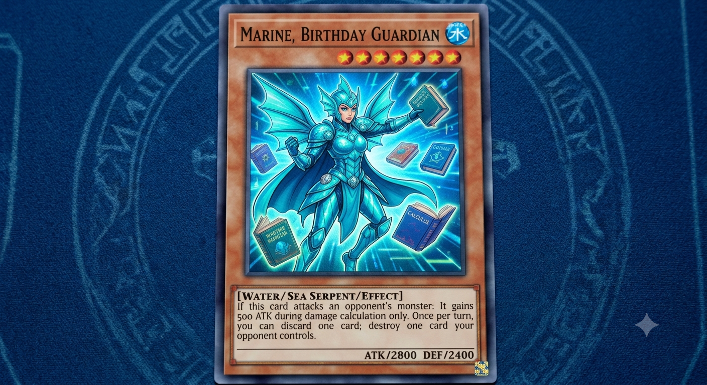

# 🎨 Image prompts for PAM's Birthday Duel

These prompts are for generating art elsewhere (Midjourney, DALL·E, Firefly,
SDXL, etc.) to replace the emoji placeholders in `index.html`.

## How to use the generated images
In `index.html`, swap the emoji inside each block for an ``:
- **Card art** → the `<div class="art">🦸‍♀️</div>` blocks (and `.foe .art`)
- **Meal art** → the `<div class="mart">🥡</div>` blocks
- **Avatars** → the `<div class="avatar">🎂</div>` blocks

Example:
```html
<div class="art"></div>
```
Add this CSS so images fill the slot neatly:
```css
.art img,.mart img,.avatar img{width:100%;height:100%;object-fit:cover;border-radius:inherit;}
```

## Shared style (paste at the end of every prompt for a consistent look)
> Yu-Gi-Oh trading-card-game illustration style, dramatic dynamic lighting,
> rich saturated colors, painterly digital art, deep navy-blue and royal-purple
> background with warm gold (#f4c542) rim light, high detail, centered subject,
> no text, no card frame, no borders, no watermark.

---

## 🦸‍♀️ Marine — "Birthday Guardian" (the hero card)  · 1024×1024 (square)
> A heroic young woman guardian standing tall and confident, glowing golden aura,
> protective older-sister energy, flowing cape catching the wind, one fist raised,
> radiant birthday-themed armor with subtle star and ribbon motifs, warm and kind
> but fierce expression. *(Customize: hair color/length, eye color, skin tone to
> match the real Marine.)* — then append the **Shared style** block.

## 😈 Sneaky Gift Snatcher — weak foe #1 (FOE1)  · 1024×1024 (square)
> A small mischievous cartoon fiend imp, sneaky grin, oversized eyes, tiptoeing
> while clutching a stolen wrapped birthday present under one arm, comically
> non-threatening, purple-and-red skin, tiny bat wings. — append **Shared style**.

## 💩 Birthday Party Pooper — weak foe #2 (FOE2)  · 1024×1024 (square)
> A grumpy little gremlin sitting on a deflated balloon, sulking with crossed
> arms, a tiny rain cloud over its head, surrounded by popped party streamers,
> sour pouty face, harmless and silly, muted red-and-grey tones. — append **Shared style**.

## 🧑‍💼 Gautier — the Challenger avatar  · 512×512 (square, head & shoulders)
> Confident playful duelist striking a "come at me" pose, smirking friendly
> rival expression, holding a single glowing card, brotherly mischievous charm.
> *(Customize to look like the real Gautier.)* — append **Shared style**.

## 🎂 PAM — the Birthday Boy avatar  · 512×512 (square, head & shoulders)
> A happy young man wearing a small party hat, big celebratory smile, confetti
> drifting around him, hero-of-the-day glow. *(Customize hair, eyes, skin tone,
> glasses/beard to match the real PAM.)* — append **Shared style**.

---

## 🥡 Chinese Feast — meal card  · 1200×675 (16:9 landscape)
> An abundant Chinese feast overhead flat-lay: steaming bamboo baskets of
> dumplings, glossy noodles, spring rolls, rice, chopsticks, red lanterns
> bokeh in the background, mouth-watering, warm appetizing lighting, food-
> photography quality, vibrant reds and golds. — append **Shared style**
> (but make the food photoreal rather than painterly).

## 🍲 Korean Feast — meal card  · 1200×675 (16:9 landscape)
> A sizzling Korean BBQ spread overhead flat-lay: grilled marinated meat, an
> array of colorful banchan side dishes, kimchi, a hot stone bibimbap bowl,
> steam rising, cobalt-blue and indigo accents, appetizing studio lighting,
> food-photography quality. — append **Shared style** (food photoreal).

## 🍣 Japanese Feast — meal card  · 1200×675 (16:9 landscape)
> A premium Japanese feast overhead flat-lay: fresh nigiri and maki sushi
> platter, a steaming bowl of ramen, edamame and gyoza sides, soy sauce and
> wasabi, elegant minimal presentation, pink-and-magenta accents, appetizing
> studio lighting, food-photography quality. — append **Shared style** (food photoreal).

---

## ✨ Optional extras
- **Title background**  · 1920×1080 — *A festive Yu-Gi-Oh style arena at night,
  glowing duel field, floating golden confetti and birthday balloons, dramatic
  spotlight beams, deep navy and purple, empty center for a title.* — append **Shared style**.
- **Victory banner / trophy**  · 1024×1024 — *A glowing golden birthday trophy
  bursting with confetti and fireworks, triumphant celebration.* — append **Shared style**.

> Tip: generate all character cards in the **same square ratio and lighting** so
> the field looks cohesive, and all three meals in the **same 16:9 ratio** so the
> gift row lines up cleanly.
